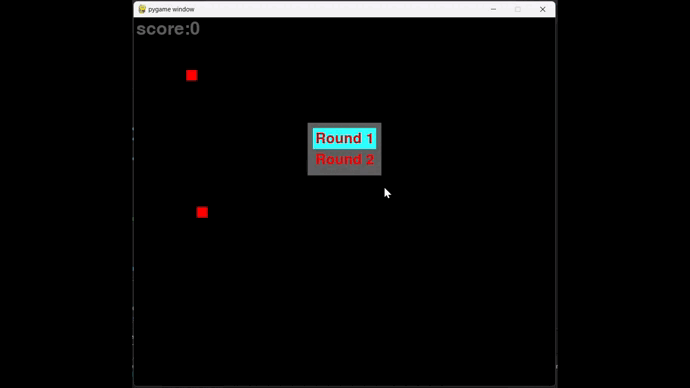
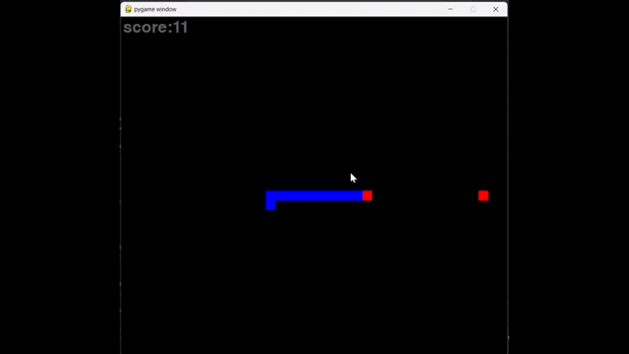
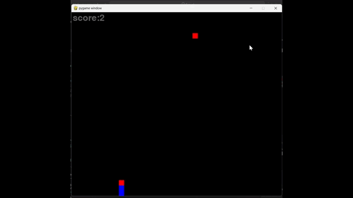
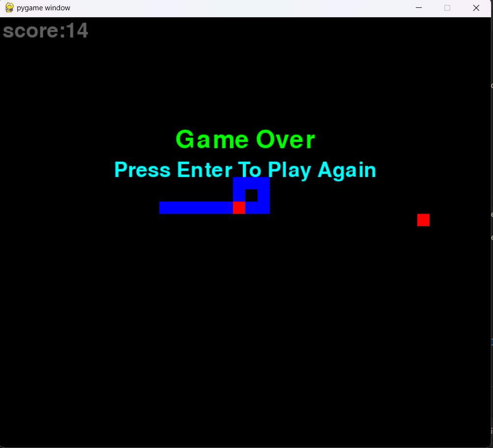
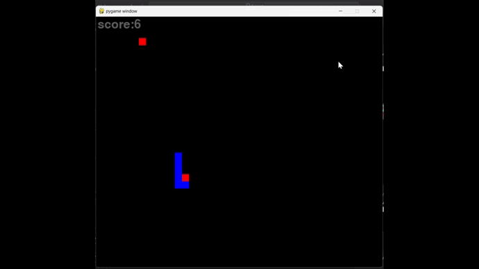
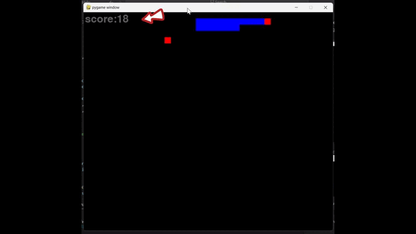
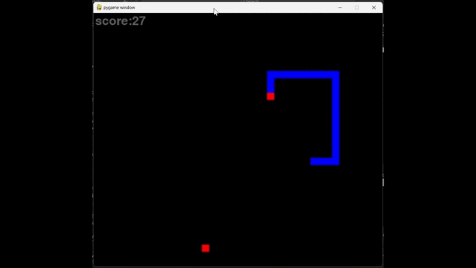

# [PYTHON] SNAKE EATS APPLE

## Introduction
Have you heard of the game Snake eats apples? This is a game with simple but challenging gameplay. When I was a kid, I used to play it on my parents' phone so I wanted to try playing it again by writing my own code.

## How to play
The gameplay is quite simple.
* First you need to choose the game mode: round 1 or round 2 by moving the up arrow, down arrow and pressing the ENTER key

* When you choose round 1, the snake will not be able to go through the wall, meaning if it goes past the side wall, the bottom wall, the left wall or the right wall, you will lose.

* When you choose round 2, the snake will move all the way to the left wall and will start on the right wall and vice versa, and when the snake goes all the way to the top wall and starts on the bottom wall and vice versa.

* When you move so that the snake's head collides with its body, you will also lose

* Warning: when you press too quickly between opposing arrow keys, the snake will turn its head and collide with its body. You will also lose. For example, you press the up arrow key and then the down arrow key too quickly.

* When the score is over 20, the snake's movement speed will also be faster

* When you lose, you need to re-select the game mode by pressing the ENTER key to play again

## How to use the code
* Please make sure you have python installed.If not you can go to the homepage to download:https://www.python.org/ and you need to install pygame and the simplest way is to use the pip tool
* Find and download files snake.py
* Run that python file
* Finally play the game
